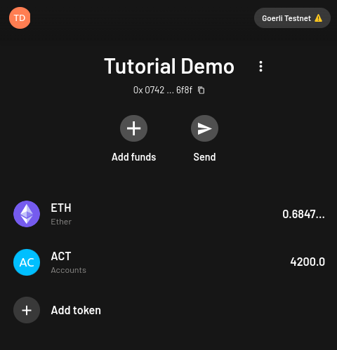
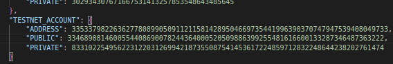

<div align="center">
    
    <h1>StarkNet Account Abstraction</h1>
    <br>

|Exercise|Topic|Points|
|---|---|---|
|[hello](contracts/hello/hello.cairo)|hello account world|100|
|[signature_1](contracts/signature/signature_1.cairo)|handling Stark signatures|100|
|[signature_2](contracts/signature/signature_2.cairo)|handling Stark signatures|200|
|[signature_3](contracts/signature/signature_3.cairo)|handling Stark signatures|300|
|[multicall](contracts/multicall/multicall.cairo)|multiple contract call account|500|
|[multisig](contracts/multisig/multisig.cairo)|multiple signature account|1000|
|[abstraction](contracts/abstraction/abstraction.cairo)|unique account architecture|2000|
</div>

# Setup

This tutorial uses the [cairo environment](https://www.cairo-lang.org/docs/quickstart.html), [starknet-devnet](https://github.com/Shard-Labs/starknet-devnet), and [starknet.py](https://github.com/software-mansion/starknet.py):

***install tutorial dependencies***

```bash
sudo apt install -y libgmp3-dev
pip3 install ecdsa fastecdsa sympy rich
pip3 install cairo-lang
```

***init cairo environment***

```bash
python3.7 -m venv ~/cairo_venv
source ~/cairo_venv/bin/activate
```

***install starknet dependencies***

```bash
pip3 install --upgrade starknet-devnet
pip3 install --upgrade starknet.py
```

***install pytest dependencies***

```bash
pip3 install --upgrade pytest pytest-asyncio
```

## Overview

This tutorial consists of various StarkNet `account conracts` and `starknet_py` helper scripts for compilation, deployment, and testing.

<div align="center">
    <strong>THE GOAL:<br>pass the `evaluator.cairo` checks and collect all the points available on StarkNet(Goerli)<br><br></strong>
</div>

To complete exercises read the `mission statement` at the top of each starknet_py script(also printed to terminal) for instructions. The exercises will get more difficult and will require you to:

- manipulate the python files
- write the relevant Cairo code.

These tasks will be annotated with the comment `# ACTION ITEM <NUM>`

### Devnet

Transactions take time to complete on [testnet](https://goerli.voyager.online) so you should develop and debug locally first. Let's try it out with the `hello/hello.cairo` exercise. There are no `# ACTION ITEM`s that need to be completed for this exercise and we can simply test that it works.

***1) init devnet***

```bash
starknet-devnet --port 5000 --seed 0 --gas-price 250
```

***2) deploy evaluator***

```bash
# NOTE: 
# - you do not have to deploy the validator for `testnet`
# - devnet contract details can be found in `contracts/accounts.json`
cd contracts
python3 evaluator.py
```

***3) deploy/test hello contract***

```bash
python3 hello/hello.py
```

The relevant evaluator contract addresses are saved to the `contracts/accounts.json` cache. For devnet testing the devnet contracts `MUST BE DELETED` everytime devnet is restarted. If you would like to disable this constract cache run:

```bash
export ACCOUNT_CACHE=false
```

There were no `action items` for you to complete so you should see a succesfull `PAYDAY!!!` response from the devnet evaluator contract. To confirm you can check your ERC20 balance as follows(populate the data in `<>` angle brackets):

```bash
curl --location --request POST 'http://localhost:5000/feeder_gateway/call_contract' \
--header 'Content-Type: application/json' \
--data-raw '{
    "contract_address": "<'contracts/accounts.json' --> 'http://localhost:5000' -->_'TDERC20-address'>",
    "entry_point_selector": "0x2e4263afad30923c891518314c3c95dbe830a16874e8abc5777a9a20b54c76e",
    "calldata": ["<'contracts/hints.json' --> 'DEVNET-ACCOUNT' --> 'ADDRESS'>"],
    "signature": []
}'
```

### Testnet

***[Argent-X](https://chrome.google.com/webstore/detail/argent-x/dlcobpjiigpikoobohmabehhmhfoodbb) Example***

When deploying to testnet fill out the relevant details in the `hints.json` file under `TESTNET_ACCOUNT` for your StarkNet account to transfer fees and receive rewards.

<div align="center">
    
</div>

***ADDRESS***

- From the example wallet above you can copy the address(`0x0742B5662...6476f8f`)
- Paste the felt representation in the `hints.json` `TESTNET_ACCOUNT` -> `ADDRESS`
- To get the felt represenation you can paste the address in this [conversion tool](https://util.turbofish.co).

***PRIVATE***

- Select the three vertical dots to display the wallet options
- Select `Export private key`
- Copy the private key from this screen and paste it in `hints.json` `TESTNET_ACCOUNT` -> `PRIVATE`.

***PUBLIC***

- Select the three vertical dots to display the wallet options
- Select `View on Voyager`
- From the Voyager Block Explorer select the `READ Contract` -> `IMPLEMENTATION` tab
- Drop down the `get_signer` selector
- Select `Decimal` query
- Copy the public key from this screen and paste it in `hints.json` `TESNET_ACCOUNT` -> `PUBLIC`

***Example `hints.json`***
<div align="center">
    
</div>

## Fees

Accounts on StarkNet must pay [fees](https://docs.starknet.io/docs/Fees/fee-mechanism) to cover the L1 footprint of their transaction. So the account details you enter must have Goerli ETH(~0.5 ETH) and can be funded either through the [starkgate bridge](https://goerli.starkgate.starknet.io) or [StarkNet Faucet](https://faucet.goerli.starknet.io).

After you have tested your contract locally you can test on `testnet` by passing the `--testnet` flag to the starknet_py script:

```bash
python3 hello/hello.py --testnet
```

## Hints

If you need hints on tutorial solutions you can find them in repository branch named `hints/all`. These will include a pytest for you to run, the completed starknet_py, and the completed cairo contract.

To run the hints:

```bash
cd hints
pytest hello.py
```

# Walk Through

Accounts on StarkNet are deployed via an [Account Abstraction](https://perama-v.github.io/cairo/account-abstraction) model.

TL;DR:

***accounts on StarkNet are simply contracts***

One caveat for account contract deployments is they must have a canonical entrypoint denoted with the selector `__execute__`.

***...and that's it!***

Lets deploy and test the simplest account contract we can:

```bash
cd contracts
python3 hello/hello.py
```

The job of an account contract is to execute arbitrary business logic on behalf of a sepcific entity. This is why we see a similar argument pattern for most execute functions:

```bash
    # contract we wish to execute our transaction on
    contract_address : felt
    
    # entry point of that contract we wish to call
    selector : felt

    # contracts will require varying lengths of calldata so we pass an array
    calldata_len : felt
    calldata : felt*
```

## [Signatures](./contracts/signatures)

Unlike Ethereum [EOAs](https://ethereum.org/en/developers/docs/accounts/#externally-owned-accounts-and-key-pairs), StarkNet accounts don't have a hard requirement on being managed by a public/private key pair.

Account abstraction cares more about `who`(i.e. the contract address) rather than `how`(i.e. the signature).

This leaves the ECDSA signature scheme up to the developer and is typically implemented using the [pedersen hash](https://docs.starknet.io/docs/Hashing/hash-functions) and native Stark curve:

```bash
cd contracts
python3 signature/signature_1.py
```

The `signature_1` contract has no concept of a public/private keypair. All the signing was done "off-chain" and yet with account abstraction we're still able to operate a functioning account with a populated signature field.

Let's couple the signing logic more succintly wtih the account:

***HINT: we have not yet implemented a [nonce](https://ethereum.org/en/developers/docs/accounts/#an-account-examined)***

```bash
cd contracts
python3 signature/signature_2.py
```

Although we are free to populate the signature field how we please, the StarkNet OS has a specific method for hashing [transaction data](https://docs.starknet.io/docs/Blocks/transactions#transaction-hash-1).

This transaction hash encompasses all the relevant `tx_info`, and typically the message_hash signed by account contracts. The account owner is thereby acknowledging all of the relevant transaction information:

```bash
cd contracts
python3 signature/signature_3.py
```

## [MultiCall](./contracts/multicall)

Now that we have implemented the vanilla ECDSA signing mechanisms lets see what account abstraction can really do!

A `multicall` aggregates the results from multiple contract calls. This reduces the number of seperate API Client or JSON-RPC requests that need to be sent. In addition it acts as an `atomic` invocation where all values are returned for the same block.

Popular wallet providers like Argent use this design to implement [account contracts](https://github.com/argentlabs/argent-contracts-starknet/blob/develop/contracts/ArgentAccount.cairo) on StarkNet to accomodate a multicall or a single call with one scheme.

There are many implementations of multicall that allow the caller flexibility in how they distribute and batch their transactions.

Let's implement a multicall account for StarkNet:

```bash
cd contracts
python3 multicall/multicall.py
```

## [MultiSig](./contracts/multisig)

A `multisig` or multiple signature wallet allows you to share security accross multiple signinging entities. You can think of them like bank vaults in that they require more than one key to unlock, or in this case authorize a transaction.

The amount of signing keys that belong to the account and the ammount of keys required to authorize a transaction are purely implementation details.

Lets implement a `2/3 multisig` account(i.e. 2 signatures are required out of a total 3 signers for a transaction to be executed):

```bash
cd contracts
python3 multisig/multisig.py
```

## [Abstraction](./contracts/abstraction)

As StarkNet accounts are simply contracts we can implement any signing mechanism we want. Companies like [Web3Auth](https://medium.com/toruslabs/sign-in-with-starkware-711d48f2dbbd) are using this to create `Sign-In` architectures using your StarkNet account. [JWT](https://github.com/BoBowchan/cairo-jsonwebtoken) token schems are being implemented.

Discussions on novel account architecutres are popping up more and [more](https://vitalik.ca/general/2022/01/26/soulbound.html) and it looks to be an increasingly important tool in the developer toolkit.

For an example of a unique account architecture we will build a contract that implements it's signatures scheme with the `secp256k1` curve and `sha256` instead of our native StarkNet curve:

```bash
cd contracts
python3 abstraction/abstraction.py
```
